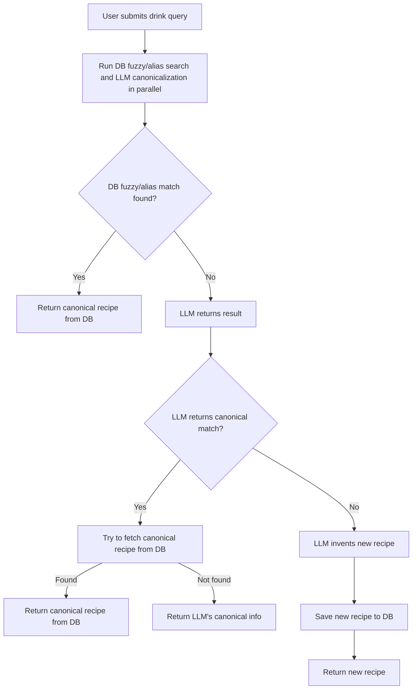
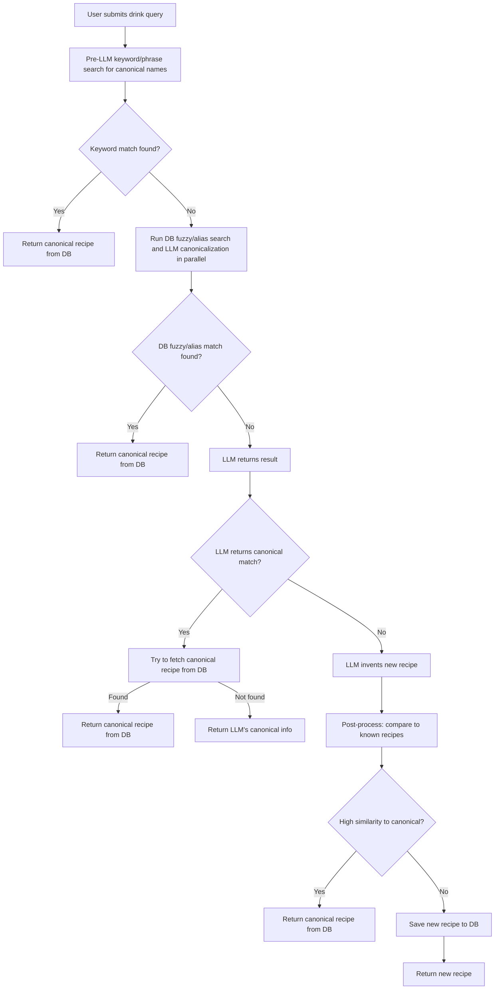

# Deduplication/Canonicalization Workflows

This document illustrates the current and proposed workflows for drink recipe deduplication and canonicalization in the Mixologist backend.

---

## Current State Workflow

The current system runs the DB fuzzy/alias search and LLM canonicalization in parallel, then selects the best match.

---

## Proposed Improved Workflow

The proposed system adds a pre-LLM keyword search and post-processing for near-matches, and enforces stricter canonicalization from the LLM.

